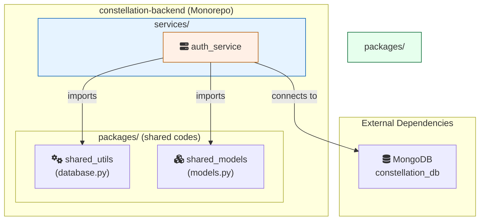

# Constellation Backend

[](https://www.python.org/downloads/release/python-3120/)
[](https://fastapi.tiangolo.com/)
[](https://github.com/astral-sh/ruff)
[](https://github.com/astral-sh/uv)

The backend monorepo for the Constellation ecosystem, a personalized suite of applications designed to manage and harmonize various aspects of family life.

This project follows a microservices architecture, where each service is an independent, deployable application built with FastAPI. It emphasizes modern, efficient development practices using tools like `uv` and `ruff`.

## Project Architecture

This is a Python monorepo managed with `uv`. It contains two primary top-level directories:

- **`/services`**: Holds the individual, standalone microservices. Each service is a complete FastAPI application.
- **`/packages`**: Contains shared code (libraries) used by one or more services, promoting the DRY (Don't Repeat Yourself) principle.

```text
constellation-backend/
│
├── .env.example              # Example environment variables file
├── .gitignore
├── pyproject.toml            # Project configuration and dependencies
├── README.md                 # This file
│
├── packages/
│   ├── shared_models/        # Shared Pydantic models
│   └── shared_utils/         # Shared utilities (e.g., database connection)
│
└── services/
    ├── auth_service/         # Handles user authentication and identity
    ├── expense_service/      # Handles expense tracking logic
    └── ...                   # Future services
```



## Tech Stack

- **Framework**: [FastAPI](https://fastapi.tiangolo.com/)
- **Database**: [MongoDB](https://www.mongodb.com/)
- **Async Driver**: [Motor](https://motor.readthedocs.io/en/stable/)
- **Package & Env Management**: [uv](https://github.com/astral-sh/uv)
- **Linting & Formatting**: [Ruff](https://github.com/astral-sh/ruff)
- **Authentication**: Stateless JWT with **Refresh Token Rotation**
- **CORS**: Handled via FastAPI Middleware for secure frontend communication.

## Monorepo-Level Development Setup

These instructions are for setting up the entire monorepo environment. For instructions on running a specific service, please see the `README.md` file within that service's directory.

### Prerequisites

- [Python](https://www.python.org/) (`3.12` or higher) & `pipx`
- [uv](https://github.com/astral-sh/uv) (`pipx install uv`)
- A running [MongoDB](https://www.mongodb.com/try/download/community) instance.

### Installation & Setup

1. **Clone the repository:**

    ```bash
    git clone [https://github.com/YenChengLai/constellation-backend.git](https://github.com/YenChengLai/constellation-backend.git)
    cd constellation-backend
    ```

2. **Create and activate the virtual environment:**

    ```bash
    uv venv
    source .venv/bin/activate  # For macOS / Linux
    # .venv\Scripts\Activate.ps1 # For Windows PowerShell
    ```

3. **Install all dependencies:**
    This command installs all core, service-specific, and development dependencies defined in `pyproject.toml`. The `-e` flag installs your local `packages` and `services` in "editable" mode, which is essential for monorepo development.

    ```bash
    uv pip install -e '.[auth,expense,dev]'
    ```

4. **Setup Environment Variables**:
    Create your local `.env` file from the template. This file contains secrets and is shared across all services.

    ```bash
    cp .env.example .env
    ```

    Then, edit the `.env` file with your specific settings (e.g., your database URI and `SECRET_KEY`).

## Available Services

Below is a list of the services available in this monorepo. Click the link for detailed information on each service's configuration, API, and how to run it.

- [Auth Service](./services/auth_service/): Handles user authentication, identity, and session management.
- (More services will be added here)

## Unit Testing

This project uses `pytest` for unit testing. Tests are located in the `/tests` directory, mirroring the `/services` structure.

To run all tests:

```bash
pytest
```
