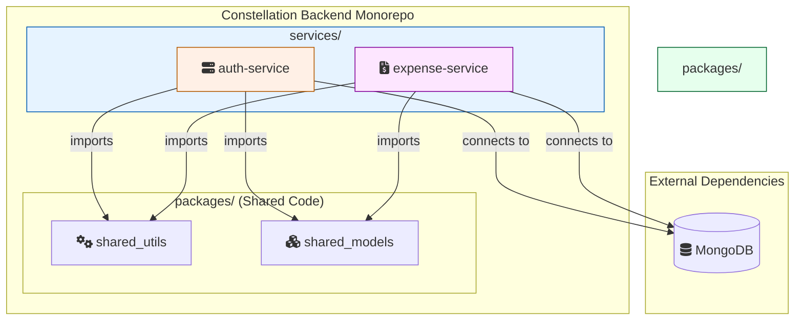
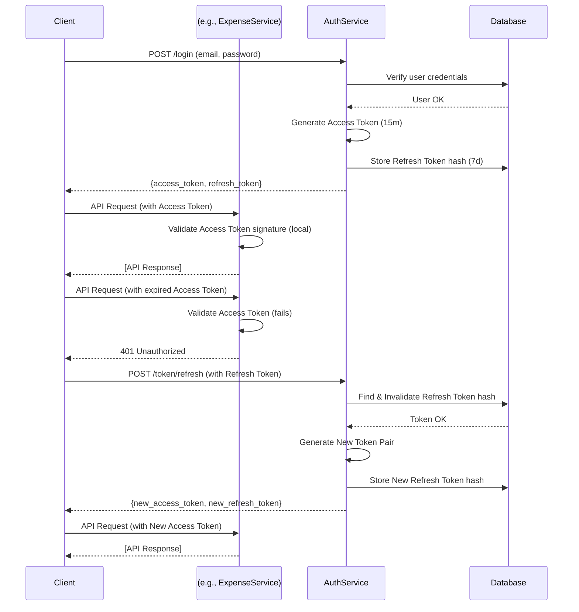

# Architecture Overview

## 1. Introduction

This document outlines the high-level architecture and guiding principles for the **Constellation** backend project. The primary goal of Constellation is to create a personalized, integrated ecosystem of applications to manage and harmonize various aspects of modern family life.

## 2. Guiding Principles

The architecture is designed with the following principles in mind:

- **Service Independence**: Each application (e.g., auth, expenses) should be a self-contained service that can be developed, deployed, and scaled independently.
- **Scalability**: The architecture should be able to grow, handling more services, more users, and more data over time.
- **Statelessness**: Business logic services should be stateless whenever possible to simplify scaling and improve resilience.
- **Testability**: The architecture must support comprehensive and isolated automated testing.

## 3. Core Architecture: Microservices

We have adopted a **microservices architecture**. The backend is not a single monolithic application but a collection of smaller, focused services that communicate over a network via well-defined APIs.

This approach allows for clear separation of concerns and enables independent development cycles for each piece of functionality within the ecosystem.

### Key Components

- **/services**: This directory in our monorepo holds each individual microservice (e.g., `auth-service`).
- **/packages**: This directory contains shared Python code (e.g., database utilities, common models) to avoid code duplication and ensure consistency across services.

### System Diagram

## 4. Authentication Strategy: JWT with Refresh Token Rotation

Authentication is the cornerstone of the ecosystem. We have implemented a modern, secure, and stateless approach to ensure secure communication between clients and services.

## The Flow:

1. Login: The user provides credentials to the auth-service. Upon success, the service issues two tokens:

    - Access Token: A short-lived (e.g., 15 minutes) JSON Web Token (JWT) containing user claims. It is sent with every API request to other services.
    - Refresh Token: A long-lived (e.g., 7 days), opaque, single-use token. Its only purpose is to get a new access token.

2. API Access: Other services (`expense-service`, etc.) receive the Access Token and validate its signature and expiration **locally** without needing to contact the `auth-service`, ensuring low latency and high performance.

3. Token Refresh: When the Access Token expires, the client sends the Refresh Token to a special endpoint on the `auth-service`.

4. Token Rotation: The `auth-service` validates the Refresh Token, invalidates it immediately upon use, and issues **a brand new pair** of Access and Refresh Tokens. This "rotation" enhances security and allows for a seamless, persistent user session.

### Sequence Diagram

## 5. Data Storage

- Database: We use **MongoDB** as our primary database due to its flexible schema, which is well-suited for an evolving project where new features and data fields will be added over time.

- Driver: All database interactions are performed asynchronously using the **Motor** driver to maximize the performance of our FastAPI services.
